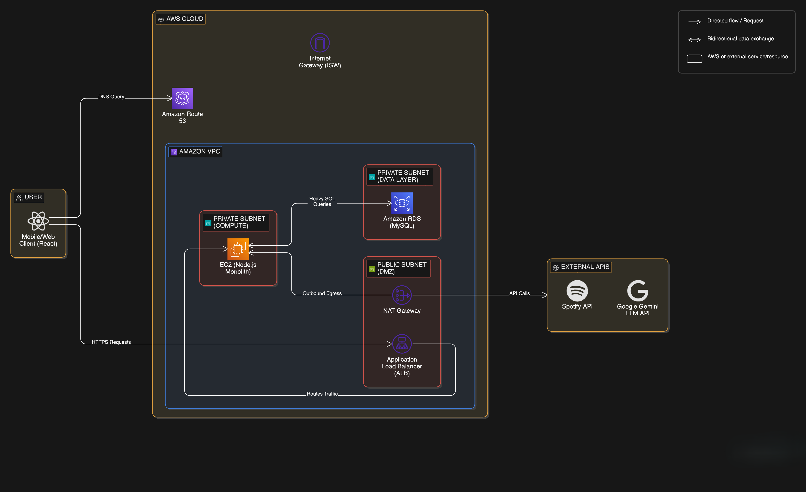
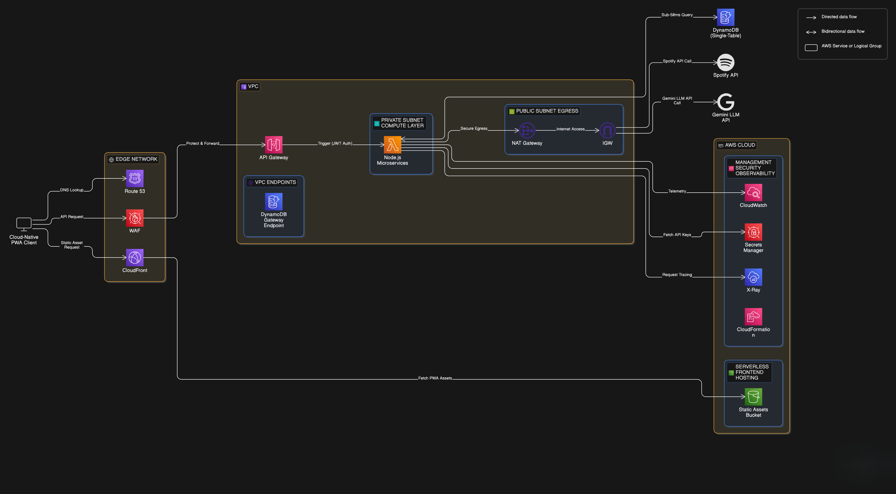

  

  

  <a href="https://moodroot.online"><strong>moodroot.online</strong></a>
  ·
  <a href="https://github.com/momo-s15/moodroot"><strong>GitHub</strong></a>

---

MoodRoot is a production, cloud-native mood tracking PWA that integrates Google Gemini and Spotify to generate AI-assisted reflections and playlists. This repository documents the **AWS modernization** from a costly, stateful monolith to a **serverless, low-latency** architecture.

## Executive Summary

- **Cost reduction**: \(~96%\) annual AWS spend, from **$744/yr** (legacy) to **$24/yr** (modernized).
- **Performance**: **sub-50ms** data-layer reads/writes via DynamoDB single-table design.
- **Security posture**: edge protection (WAF), managed secrets (Secrets Manager), and centralized observability (CloudWatch + X-Ray).
- **Delivery**: shipped to **50+ users** with a cloud-native PWA front end.

## Architecture (Legacy — Stateful Monolith)

The legacy system ran a stateful Node.js monolith on EC2 with MySQL on RDS. Outbound calls to external APIs required NAT egress, increasing operational overhead and baseline cost.

  

<em>Legacy: EC2 + ALB + RDS MySQL — stateful sessions, higher cost floor</em>

### Legacy Data Flows

- **Client → Route 53**: DNS query
- **Client → ALB**: HTTPS requests
- **ALB → EC2**: routes traffic
- **EC2 ↔ RDS**: heavy SQL queries
- **EC2 → NAT**: outbound egress
- **NAT → External APIs**: Gemini + Spotify API calls

## Architecture (Modernized — Cloud-Native Serverless)

The modern architecture moves static delivery to CloudFront + S3 and refactors the application into Lambda microservices behind API Gateway. Stateful session handling is removed by using **stateless JWT authentication**, and MySQL is replaced by a **DynamoDB single-table design**.

  

<em>Modernized: CloudFront + S3 + API Gateway + Lambda + DynamoDB — low cost, low latency, managed ops</em>

### Modern Data Flows

- **Client → Route 53**: DNS
- **Client → CloudFront → S3**: static PWA assets
- **Client → WAF → API Gateway**: API requests
- **API Gateway → Lambda**: triggers Node.js microservices
- **Lambda ↔ DynamoDB**: sub-50ms query via VPC endpoint
- **Lambda → Secrets Manager**: fetch API keys
- **Lambda → External APIs**: secure egress via NAT to Gemini + Spotify
- **Lambda → CloudWatch/X-Ray**: telemetry

## Solution Architecture Highlights

- **Serverless-by-default**: eliminates always-on compute, scales on demand, reduces operational burden.
- **Single-table DynamoDB model**: purpose-built access patterns and RCU optimization for consistent low latency.
- **Edge-first security**: WAF protection at the perimeter; minimized direct exposure of origin services.
- **Observability**: request tracing (X-Ray) + structured logging/metrics (CloudWatch).
- **Infrastructure as Code**: CloudFormation used for repeatable, auditable deployments.

## Tech Stack

- **Frontend**: Cloud-native PWA (React)
- **Backend**: Node.js (Lambda microservices), API Gateway (JWT auth)
- **Data layer**: DynamoDB (single-table)
- **Edge**: Route 53, CloudFront, WAF
- **Security/Ops**: Secrets Manager, CloudWatch, X-Ray

## Website

- **Production**: `https://moodroot.online`

